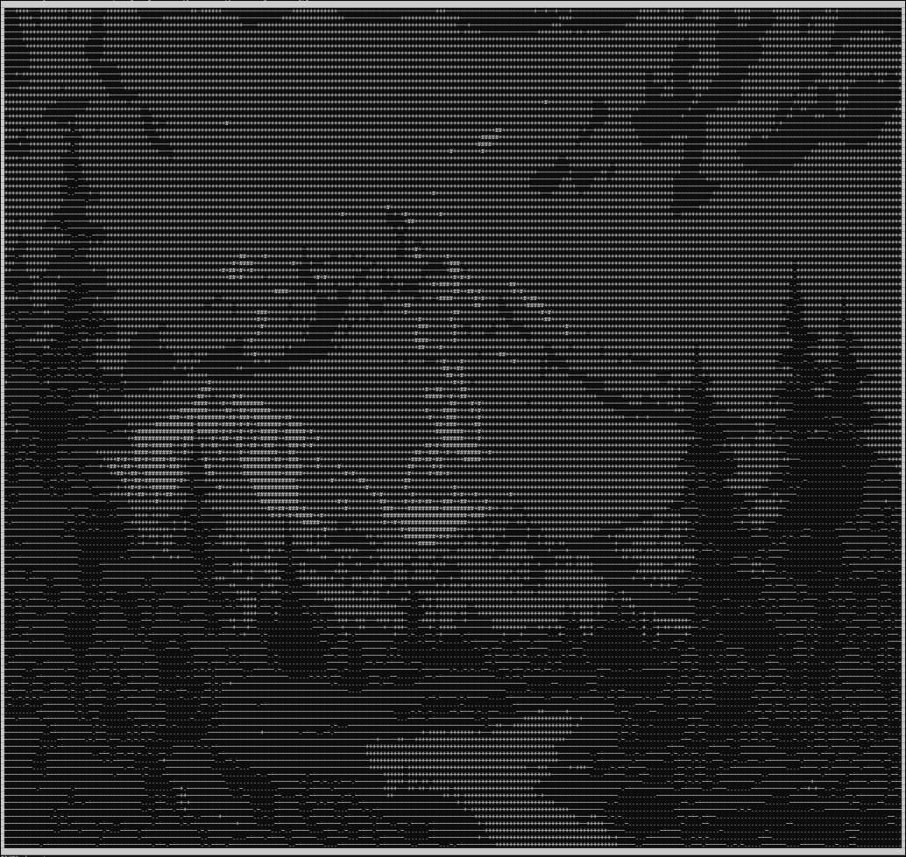

# image-ascii
Just a simple image to ascii converter.

# Running
- Run `setup.bat`
- Enter python environment
- Run `python main.py [image_path] [target_width] [target_height]`

# Showcase
### Mona Lisa

### Bob Ross Painting

### Rick Astley
